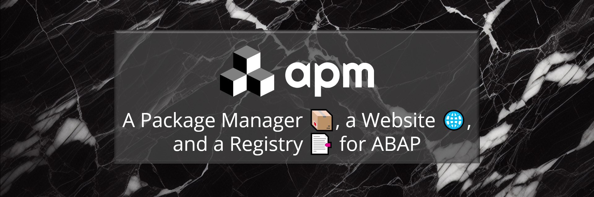
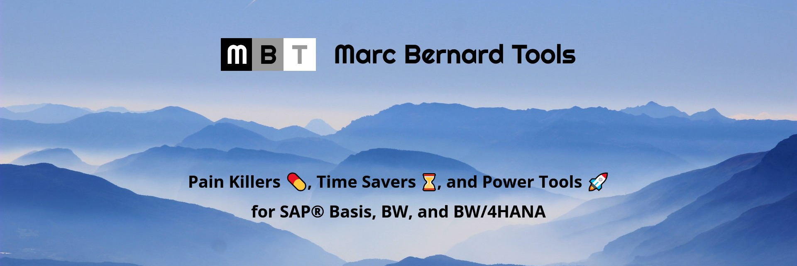

### Hi, there! It's Marc 👋

# I bring open-source to the world of ABAP

If you like my work, please consider a regular donation through 👉 [GitHub Sponsors](https://github.com/sponsors/mbtools) 👈 starting from $1/month or just one single contribution.

Thank you, so much 🙏

Marc

Head over to https://github.com/mbtools for my contributions to other open-source projects

### My Open-Source Projects

<!-- apm - A Package Manager 📦, a Website 🌐, and a Registry 📑 for ABAP, 👉 https://abappm.com -->

<!-- Marc Bernard Tools - Pain Killers 💊, Time Savers ⌛️, and Power Tools 🚀 for SAP® Basis, BW, and BW/4HANA, 👉 https://marcbernardtools.com -->

### ABAP and Related Open-Source Contributions

- [abapGit](https://abapgit.org/) - Too many to count

- [abaplint](https://abaplint.org/) - Some little additions and improvements

- [ajson](https://github.com/sbcgua/ajson) - Added diff and sort utilities

- [ABAP Logger](https://github.com/ABAP-Logger/ABAP-Logger) - General maintenance, fixes, down ports

- [ABAP Mime Editor](https://github.com/larshp/mime_editor) - Added editor for W3MI objects

- [Monaco](https://github.com/microsoft/monaco-editor) - Update to ABAP 7.5x language syntax (latest 7.55)

- [TODO to Issue Action](https://github.com/alstr/todo-to-issue-action) - Added support for ABAP

- [Exercism](https://github.com/exercism/abap) - One of the initial creators of the ABAP Track and contributor to several exercises

### Other Open-Source Contributions

- [Verdaccio](https://github.com/verdaccio/verdaccio) - One of the core maintainers with 160+ commits

- [npm](https://github.com/npm) - Fixing bugs, improving docs, replacing dependencies ([cli](https://github.com/npm/cli), [semver](https://github.com/npm/node-semver), [pacote](https://github.com/npm/pacote),  [npm-registry-fetch](https://github.com/npm/npm-registry-fetch),  [promise-spawn](https://github.com/npm/promise-spawn))

- [Shields](https://github.com/badges/shields) - Added badges for "[ClearlyDefined Score](https://shields.io/badges/clearly-defined-score)" and "[GitHub Check Runs](https://shields.io/badges)"

- [React JSON View](https://github.com/microlinkhq/react-json-view) - Clipboard integration

- [SPDX](https://github.com/spdx/license-list-XML) - Improving notes about GPL licenses

- [Suffusion](https://github.com/sayontan/suffusion) - Lead maintainer of Suffusion WordPress Theme

PS: Visit my 👉 [corner store](https://marcfbe.gumroad.com/) 👈 
